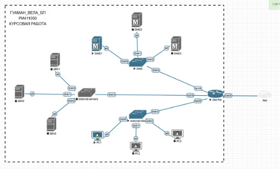

# proxy-auth
Authenticated proxy using Squid on Ubuntu Server 22.04. Includes network segmentation, ACLs, and firewall configuration in a simulated environment with Cisco devices. Developed as part of a course on information protection in computer networks.

# Linux Proxy Authentication Lab – Squid + ACL

This repository contains a network security lab focused on implementing an authenticated proxy using Squid on Ubuntu Server 22.04. The project includes complete network segmentation, firewall rules, ACLs, and proxy-based traffic control. It was developed as part of the “Information Protection in Computer Networks” course at UrFU.

---

## Overview

The network topology consists of three main zones:  
- DMZ (Demilitarized Zone)  
- Internal Servers  
- Internal Clients  

A Cisco router/firewall (GW-FW) connects all segments and applies NAT, routing, and ACLs. The proxy server (Squid) is hosted on SRV1 inside the internal servers zone, enforcing user authentication before allowing access to the internet. Direct access from clients is blocked using ACLs.

---

## Node Table

| Zone             | Node  | Interface | DMZ Interface | Internal-Servers Interface | Internal-Clients Interface | IP Address   |
|------------------|-------|-----------|---------------|-----------------------------|-----------------------------|--------------|
| -                | GW-FW | fa1/0     | Gi0/3         | -                           | -                           | 172.16.1.1   |
| -                | GW-FW | fa2/0     | -             | Gi0/3                       | -                           | 172.16.2.1   |
| -                | GW-FW | fa3/0     | -             | -                           | Gi0/3                       | 172.16.2.3   |
| DMZ              | DMZ1  | e0        | Gi0/0         | -                           | -                           | 172.16.1.2   |
| DMZ              | DMZ2  | e0        | Gi0/1         | -                           | -                           | 172.16.1.3   |
| DMZ              | DMZ3  | e0        | Gi0/2         | -                           | -                           | 172.16.1.4   |
| Internal-servers | SRV1  | e0        | -             | Gi0/0                       | -                           | 172.16.2.2   |
| Internal-servers | SRV2  | e0        | -             | Gi0/1                       | -                           | 172.16.2.3   |
| Internal-servers | SRV3  | e0        | -             | Gi0/2                       | -                           | 172.16.2.4   |
| Internal-clients | PC1   | e0        | -             | -                           | Gi0/0                       | 172.16.3.2   |
| Internal-clients | PC2   | e0        | -             | -                           | Gi0/1                       | 172.16.3.3   |
| Internal-clients | PC3   | e0        | -             | -                           | Gi0/2                       | 172.16.3.4   |

---

## Technical Details

For complete configuration steps, proxy setup, ACL rules, and validation methods, refer to:

- `README_proxy_EN.md` – full technical documentation in English  
- `README_proxy_ES.md` – informe detallado en español

---

## Author

Bruno Paolo Huaman Vela  (Lima, Peru)
Information Security of Telecommunication Systems – UrFU  
